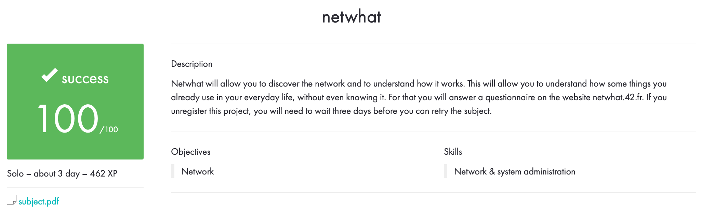

# netwhat

## Description

A small cheat sheet for people who are going to take netwhat.

This project will allow us to discover the network and understand how it works. This will allow us to understand how some of the things that we already use in our daily lives work without even knowing it. To do this, we will answer the questionnaire on the website [netwhat.42.fr](netwhat.42.fr). If you cancel the registration of this project, you will have to wait three days before you can try again.

## Useful links

[Excellent guide](https://github.com/markveligod/netwhat)

[Tester](https://github.com/adblanc/netwhat42-train)

[Calculator](http://infocisco.ru/ip_calculator.php)

[Well, the most important link :)](https://www.google.ru)

## Evaluation

